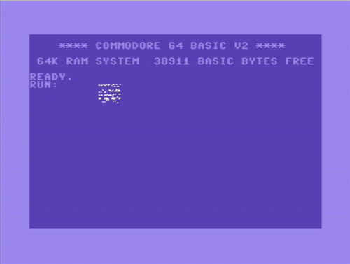
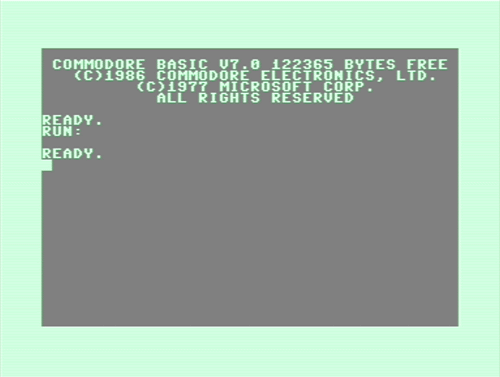

Durante la scrittura della libreria [c128lib](https://github.com/c128lib),
mi sono imbattuto nella gestione dei testi e, soprattutto, della grafica.
Considerando la gestione degli sprite, la base di funzionamento è molto simile:
il Vic-II espone i registri per gestire gli sprite nelle stesse locazioni del C64
rendendo perciò il porting quasi trasparente.

Quasi.

Si perché se accendessimo il C64 mandando in esecuzione questo programma in 
assembly:

``` Assembly
    lda #%00000001
    sta $d015

    lda #100
    sta $d000
    sta $d001
```

troveremmo lo sprite 0 attivato (con della porcheria ma non è rilevante per questo
esempio) in posizione (100, 100). 

Il codice attiva solo lo sprite 0 e imposta le coordinate agendo sui registri del
Vic-II. Ecco il risultato (potreste avere uno sprite diverso ma il risultato più
o meno sarà questo):



Visto che ho detto che il porting è QUASI trasparente, proviamo a eseguire lo
stesso codice sul C128. Rammento che, i registri del Vic-II sul C128 sono gli
stessi del C64, alle stesse locazioni e con lo stesso comportamento. Ecco il
risultato:



Il risultato è NIENTE. Alla faccia del porting trasparente.

Ma naturalmente c'è una spiegazione a tutto ciò. Il porting è effettivamente
semplice ma ci sono delle nuove strutture e comportamenti introdotti con il C128
che richiedono un minimo di modifiche.

Va considerato che ci sono delle cose chiamate Shadow Registers. In pratica sono
delle locazioni di memoria i cui valori periodicamente sovrascrivono i registri
hardware del Vic-II. 

Per questo motivo, il nostro programma che agisce direttamente sui registri del
Vic-II, non avrà nessun effetto dal punto di vista grafico perché i nostri dati
vengono sistematicamente sovrascritti (ogni 1/50s per i sistemi PAL e ogni 1/60s
per i sistemi NTSC) con il valore contenuto negli Shadow Registers.

Ma perché tutto ciò? Perché complicare l'esistenza del provero programmatore
assembly che, in quanto programmatore assembly, ne ha già abbastanza? 

Il Basic del C128 è molto più evoluto rispetto a quello del C64 e sono
state aggiunte diverse istruzioni che rendono più semplici tante operazioni. 
Prendiamo ad esempio l'istruzione MOVSPR che permette di spostare uno sprite sullo
schermo. L'istruzione inoltre, consente anche di animarlo specificando un
"percorso", lasciando al sistema l'onere di calcolare la posizione ad ogni
aggiornamento.
Ed è in questo caso che entrano in gioco gli Shadow Registers: sono di fatto un
sistema di disaccoppiamento tra la parte di calcolo della posizione e la parte
che si incarica di visualizzarla.

La MOVSPR con i suoi automatismi di calcolo fa tutto il lavoro e inserisce i 
risultati negli opportuni Shadow Registers. Ad intervalli di 1/50s (o 1/60s), una
routine Kernal (la Screen IRQ) prende i dati dagli Shadow Registers e li copia nei
registri hardware.

Il disaccoppiamento consente di non legare le tempistiche di calcolo con la 
visualizzazione: quando i dati sono pronti vengono aggiornati altrimenti si
tengono quelli vecchi.

Dal punto di vista dello sviluppatore assembly, per convivere con questa Screen 
IRQ ci sono due modi: adattarsi o disattivarla.

L'adattamento consiste nello scrivere codice puntando agli Shadow Registers,
lasciando che la Screen IRQ faccia il suo normale lavoro di copia.
Il risultato può essere ottenuto con questo codice:

``` Assembly
    lda #%00000001
    sta $d015

    lda #100
    sta $11d6
    sta $11d7
```

Come si può vedere, il codice fa riferimento ai registri $11d6 e $11d7 che sono
rispettivamente gli shadow di $d000 e $d001.

L'alternativa è sopprimere la Screen IRQ anteponendo al nostro codice alcune
istruzioni che modificano una particolare locazione nella zero-page ([$D8](https://c128lib.github.io/Reference/0000#D8)).
Il codice risultante è il seguente:

``` Assembly
    lda #$ff
    sta $d8

    lda #%00000001
    sta $d015

    lda #100
    sta $d000
    sta $d001
```

La disattivazione della Screen IRQ ci permette di operare direttamente con i
registri hardware rendendo di fatto identico il codice al C64, ma questo porta
delle limitazioni nell'uso di alcune istruzioni Basic, ad esempio la MOVSPR non
funzionerà più, ma qui la scelta è dello sviluppatore.

Per approfondire:
* qui c'è il
[link](https://c128lib.github.io/Reference/Vic#screen-irq-routines)
alla reference del progetto c128lib con informazioni più esaustive sulla
Screen IRQ
* qui il riferimento al [registro D8](https://c128lib.github.io/Reference/0000#D8) per disattivare la Screen IRQ
